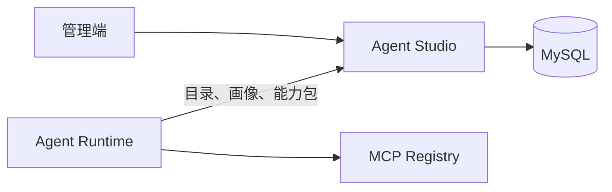

# 架构总览

Agent Studio 是 Agent 运行资料的数据所有者，维护 Agent 画像、Skill 定义/契约、Agent-Skill 绑定和 Skill-Tool 绑定。Runtime 读取其活动目录、画像、Skill 摘要和能力包，以驱动对话与工具编排。

```mermaid
flowchart LR
  App[管理端] --> Studio[Agent Studio]
  Studio --> DB[(MySQL)]
  Runtime[Agent Runtime] -->|目录、画像、能力包| Studio
  Runtime --> Registry[MCP Registry]
```

不负责对话执行、任务检查点、MCP 服务注册或模型供应商管理。
